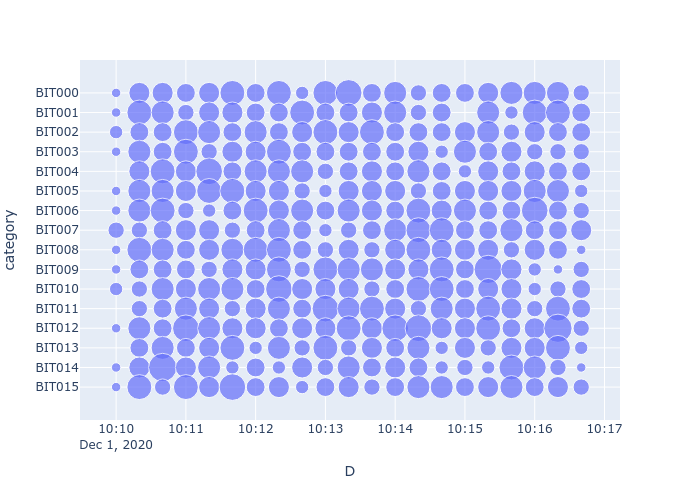

<!-- START doctoc generated TOC please keep comment here to allow auto update -->
<!-- DON'T EDIT THIS SECTION, INSTEAD RE-RUN doctoc TO UPDATE -->
**Table of Contents**

- [csv_tools](#csv_tools)
  - [なぜこれを作ったか](#%E3%81%AA%E3%81%9C%E3%81%93%E3%82%8C%E3%82%92%E4%BD%9C%E3%81%A3%E3%81%9F%E3%81%8B)
  - [スタートガイド](#%E3%82%B9%E3%82%BF%E3%83%BC%E3%83%88%E3%82%AC%E3%82%A4%E3%83%89)
    - [必要条件](#%E5%BF%85%E8%A6%81%E6%9D%A1%E4%BB%B6)
    - [インストール](#%E3%82%A4%E3%83%B3%E3%82%B9%E3%83%88%E3%83%BC%E3%83%AB)
  - [ツールのリスト](#%E3%83%84%E3%83%BC%E3%83%AB%E3%81%AE%E3%83%AA%E3%82%B9%E3%83%88)
  - [主として利用しているライブラリなど](#%E4%B8%BB%E3%81%A8%E3%81%97%E3%81%A6%E5%88%A9%E7%94%A8%E3%81%97%E3%81%A6%E3%81%84%E3%82%8B%E3%83%A9%E3%82%A4%E3%83%96%E3%83%A9%E3%83%AA%E3%81%AA%E3%81%A9)
  - [作者](#%E4%BD%9C%E8%80%85)
  - [ライセンス](#%E3%83%A9%E3%82%A4%E3%82%BB%E3%83%B3%E3%82%B9)
  - [謝辞](#%E8%AC%9D%E8%BE%9E)
- [参考サイト](#%E5%8F%82%E8%80%83%E3%82%B5%E3%82%A4%E3%83%88)

<!-- END doctoc generated TOC please keep comment here to allow auto update -->

# csv_tools
PythonやBashシェルスクリプで作成したCSV(Comma Separated Value)ファイルを取り扱うコマンドラインツール集。

主な機能は以下の通り。

- CSVファイル内のデータを可視化するチャートの作成([Plotly Express](https://plotly.com/python/plotly-express/)による)
- Pythonの[pandas](https://pandas.pydata.org/)の機能を用いたCSVの処理
- [csvkit](https://csvkit.readthedocs.io/en/latest/),[xsv](https://github.com/BurntSushi/xsv)などのCSV用ツールを用いた処理

収録しているツールのリストは[コマンドリスト](COMMAND_LIST.md)に示した。

## なぜこれを作ったか

製造現場での品質管理や、深層学習適用を考えた場合、既存の製造現場の状況確認は必須となる。
本来均質であることを前提にする部分 ー例えば検査装置の同種複数のセンサーの出力ー が実際には偏りを持っていた場合、均質前提でデータを収集し、深層学習の学習データとすることはいい結果を産まない。
またこの種の不均質性は、本来あってほしくないものでありながら、経年変化や機材の更新により生じやすいものであり、監視すべき項目となる。

この均質さを確認するために、現場で使用されているPLC(Programable Logic Controler)などから出力される比較的巨大なCSVファイルを表計算ソフトなどで処理を行おうとすると、データサイズ的な問題や、処理速度、機能面で問題が発生する。大体この手のCSVファイルは、行数とはともかく、列数がやたら多く、数千列というのもザラで、そのままデータベースへ登録することもままならない。

このため、できるだけ高速で且つ柔軟に処理することを目的として、複数のコマンドライン型ツールをパイプ接続した形で、試行錯誤しながら使うことを目的にここにあるツールを作成した。

特に plotly express のデータに対する柔軟性や、チャート種別の豊富な点は、どこに偏りがあるか探しながらデータ解析を行う上では非常に強力な手段となる。

ここで作成したコマンドツールの組み合わせで、様々な処理や可視化を行い、特徴を把握しやすい有望そうな処理手順、可視化形式を決めて、シェルスクリプト化、又は単独アプリケーションとすることで、
再現性を持たせた上で、状況(均質性)の監視に用いる。

## スタートガイド

プロジェクトをローカルに複製して、検証、実行する手順を説明します

### 必要条件

OSは Ubuntu 18/20 において開発、動作確認を実施している。
その他の必要なパッケージは以下の通り。

- python 3.8.6
- python packages
	- Pillow 8.0.1
	- plotly 4.12.0
	- openpyxl 3.0.5
	- lmfit 1.0.1
	- numpy 1.19.2
	- pandas 1.1.4
	- scipy 1.5.2
	- seaborn 0.11.0
	- statsmodels 0.12.0
	- csvtotable
- [csvkit](https://github.com/wireservice/csvkit) 1.0.5
- csvtool 1.5.1
- nkf 2.1.4  
  `csv_wc.sh`にて使用
- sqlite3 3.34.0  
  `csv_sqlite_insert.sh,csv_to_db_csvkit.sh,csv_to_db_shell.sh`にて使用
- [xsv](https://github.com/BurntSushi/xsv) 0.13.0  
  `csv_join.sh,csv_status_xsv.sh,csv_tool_list.sh`にて使用
- [jp](https://github.com/sgreben/jp)  
  `csv_hist_console.sh`にて使用


```shell
sudo apt install csvtool nkf sqlite3
conda install pillow openpyxl lmfit numpy pandas scipy seaborn statsmodels
pip install --upgrade csvtotable
```

plotly,xsv,jpについては、以下を参照してインストールを行う。

- plotlyについては [Getting Started with Plotly \| Python \| Plotly](https://plotly.com/python/getting-started/) を参照のこと  
- xsv については [BurntSushi/xsv: A fast CSV command line toolkit written in Rust\.](https://github.com/BurntSushi/xsv) を参照のこと  
- jp については [sgreben/jp: dead simple terminal plots from JSON data\. single binary, no dependencies\. linux, osx, windows\.](https://github.com/sgreben/jp) を参照のこと


### インストール

git cloneでダウンロードした後に、`csv_utility`ディレクトリと`csv_plot`ディレクトリにPATHを設定する。
又は選択したものをPATHの設定されたディレクトリにコピーして使用する。


```shell
git clone https://github.com/maundergit/csv_tools.git
```


`examples`ディレクトリに移動して、以下のコマンドを実行することにより、ビット情報の20秒毎のヒストグラムが散布図
形式で得られる


```shell
csv_trimtime.py --change_timefreq='D=ABC002:%Y-%m-%d %H\:%M\:%S:floor:20s' bit-pattern-headers.csv|\  
	csv_status.py --mode sum --group D -|csv_uty.py --drop_columns=ABC000,ABC001 - |\  
    csv_uty.py --stack=D - |csv_plot_scatter.py --output=bit-pattern_time_histogram.html --size=stacked_result - D category
```



チャート描画のサンプルは`examples`ディレクトリーへ移動して、`csv_plot/csv_plot_sample.sh`を実行することで、チャートの例が生成される。
その他のサンプルについては、各コマンドのHelp出力(`--help`)を参照のこと。

## ツールのリスト

収録しているツールのリストは[コマンドリスト](COMMAND_LIST.md)に示した。

各コマンドのヘルプメッセージを [csv_plot_help](csv_plot/csv_plot_help.md)と[csv_utility_help](csv_utility/csv_utility_help.md)にまとめている。


## 主として利用しているライブラリなど

* [Plotly](https://plotly.com/python/) - CSVデータの可視化のためにチャート生成に使用
* [pandas](https://pandas.pydata.org/) - CSVデータのPythonへの読み込み及び各種の処理に使用
* [csvkit](https://csvkit.readthedocs.io/en/latest/),[xsv](https://github.com/BurntSushi/xsv) - シェルスクリプトにおけるCSVの処理に利用


## 作者

* **m.na.akei** - [maundergit](https://github.com/maundergit)


## ライセンス

This project is licensed under the MIT License - see the [LICENSE](LICENSE) file for details  

このプロジェクトは MIT License のもとで公開しています。詳しくは[LICENSE](LICENSE) を参照してください。

## 謝辞

* CSVを取扱ための様々なツールを開発、提供してくれている方々に感謝！  
  特に、 [csvkit](https://github.com/wireservice/csvkit)は、パイプ接続を用いた組み合わせによる柔軟さと強力さを教えてもらいました。
* Pandas+[Plotly](https://plotly.com/python/)の組み合わせは、データの方を気にせず、多次元データの表示が容易にできるばかりでなく、
  インタラクティブ型のチャートを他の人と配布、共有できる点で、議論がしやすくなり、非常に強力な環境を構築できました。
* [Data Processing Resources: Command\-line Interface \(CLI\) for CSV, TSV, JSON, and XML \| FZ Blogs](https://ileriseviye.wordpress.com/2018/07/10/data-processing-resources-command-line-interface-cli-for-csv-tsv-json-and-xml/) には様々なCSV取扱ツールの最新情報があり、CSVの処理で大変参考になりました。


# 参考サイト

- [Plotly Python Graphing Library \| Python \| Plotly](https://plotly.com/python/)  
  非常に豊富なチャート表示が可能で、インタラクティブ型チャートをHTMLファイルとして保存できる。 多次元チャート表示が容易に行えるため、多変量解析には強力なツールとなる。
- [wireservice/csvkit: A suite of utilities for converting to and working with CSV, the king of tabular file formats\.](https://github.com/wireservice/csvkit)  
  CSVを取り扱うためのコマンドラインツール
- [BurntSushi/xsv: A fast CSV command line toolkit written in Rust\.](https://github.com/BurntSushi/xsv)  
  Rust製の非常に高速なCSV処理ツール
- [sgreben/jp: dead simple terminal plots from JSON data\. single binary, no dependencies\. linux, osx, windows\.](https://github.com/sgreben/jp)  
  Go言語性のテキストコンソール上でのチャート描画ツール
- [Data Processing Resources: Command\-line Interface \(CLI\) for CSV, TSV, JSON, and XML \| FZ Blogs](https://ileriseviye.wordpress.com/2018/07/10/data-processing-resources-command-line-interface-cli-for-csv-tsv-json-and-xml/)  
  CSVを取り扱うためのコマンドラインツールのリスト
- [Brian Connelly \| Working with CSVs on the Command Line](https://bconnelly.net/posts/working_with_csvs_on_the_command_line/)  
  OS付属の標準コマンド(cat,awkなど)によるCSVの取り扱いTIPS集
- [DataTables \| Table plug\-in for jQuery](https://datatables.net/)  
  HTML上のTable表示用スタイル
- [GNU Bash manual \- GNU Project \- Free Software Foundation](https://www.gnu.org/software/bash/manual/)  
  

