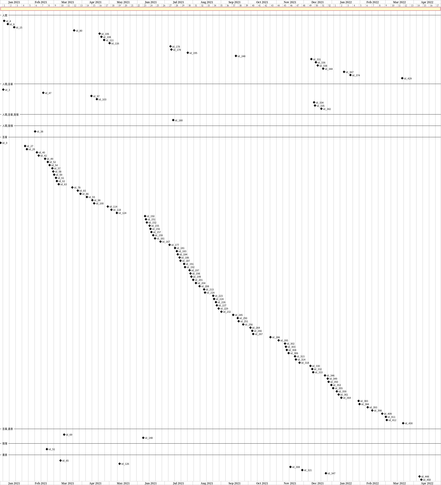

<!-- File: TextTimeseries.md                      -->
<!-- Description:               -->
<!-- Copyright (C) 2021 by m.na.akei   -->
<!-- Time-stamp: "2021-05-01 18:52:17" -->

# テキスト文書の時系列データ分析 #
## 何が問題か？
帳票やフォーム入力で作成される業務用文書の扱いを考えた場合、複数の書き手の存在、業務固有の表現、語句の扱いや、時刻に紐付いた短文の塊が対象となる。
また業務文書の特徴としては、業界/業務/組織固有の語句や表現、更には期初／期末といった、語句の季節変動や、
なにかのイベントに連動した文書中に出現する語句や記録される時間間隔の変動が挙げられる。

テキストの分析手法について調べるとAI主流で、前処理としての形態要素解析や、ベクトル化という話題がかなり見つかるが、
先に記したような **短文** , **固有表現** からなる業務文書を入力として、この前処理に至る部分の情報、つまり業務文書の初期分析に関する情報が少ない様に感じる。

特に、時刻付きの文書の場合、時刻に結びついた語句の現れ方や記録される時間間隔の変動についても把握しないと
記録の相互の関係性や定常状態／非定常状態の区別もつけ難くなり、続けてAI等の高度な処理を行う際に支障となる。
<!-- より高度な処理を目的としたAI処理の導入を考えても、学習データセットの品質に問題をはらんだままとなってしまう。 -->

短文の集まりとなっている業務文書中で、特有の表現、固有の語句を把握しようとすると、まずは複数の情報を一覧に並べた上で
登場する語句にはなにがあるか、どういう言葉の使われ方がされているか を人が眺めて調べる必要がある。
既存の手段でやろうとすると、Excelの様なスプレッドーシートに時刻列と文書列を用意して行うことになるが、
注目語句を把握しながらとなると、簡単な強調表示機能などが無い普通の表計算ソフトでは無理がある。

また、業務文書の時刻変動を把握しようとすると、例えばWord Cloudをアニメーション化する方法や、
共起ネットワークのアニメーション化などを思いつくが、なかなか適当なツールが見当たらない([Gephi \- The Open Graph Viz Platform](https://gephi.org/)ならできそうではあるが...)。

語句のベクトル化結果から、時系列表記を行うことも考えられるが、そもそも初期の分析段階では対象語句も明確でなくベクトル化自体が難しいため、これも初期分析手段としてはもう一つである。


## 業務文書の初期分析
ここでは
[csv\_tools: command line tools to handle CSV\(Comma Separated Value\) file by python and bash script](https://github.com/maundergit/csv_tools)
を用いて、業務文書の初期分析を行う方法について書いてみる。

以下では文書の初期分析として、次の内容を考える。

+ 時刻分布の初期分析などから注目すべき文書を中心に調べて語句の選定を行い、その使われ方から文書間での関連性を読み取る


### 情報の正規化処理

日本語テキストでは、全角半角の区別があるため、各種処理前には正規化処理が必要である。
基本的には全角数字、全角記号の半角化などを行う。
Pythonで処理することを前提にすると[unicodedata](https://docs.python.org/ja/3/library/unicodedata.html)パッケージの
`unicodedata.normalize` を用いればよい。

通常のテキスト処理では、数字について対象外とするため'00'で置き換えるなどの処理が正規化処理として行われている。
しかし、業務文書、特に製造系のテキスト情報としては、監視閾値等の意味から固有名詞化している場合もあるため、この段階では'00'への置き換えは行わない。
また、漢数字で記載される場合もあり、その処理については前後語句などと合わせて処理を行う必要がある(例: 九州 -/-> 9州)。


### 時刻情報の初期分析
時刻情報付きの文書を対象とするとき、取っ掛かりとしてまず何か特徴をさがすには記録された時刻の分布を見るのが最初となる。
もし、対象文書が種別等の類別可能な情報を持っているなら、種別ごとに以下の処理を行うことで、種別ごとの特徴を発見する手がかりが得られる。

文書に紐づけられた時刻の分布を見るには、まずは [ストリップチャート](https://plotly.com/python/strip-charts/) や [バイオリンチャート](https://en.wikipedia.org/wiki/Violin_plot) 、時刻の間隔の統計的な分析を行い、分布の偏りの有無や集中する時刻帯を確認する。

時刻情報(datetime)列を持つCSVをファイル(text.csv)を考えたとき、時刻分布のストリップチャート、バイオリンチャートは以下のように生成できる。

```shell
csv_plot_strip.py --datetime="%Y-%m-%d %H:%M:%S" --output=text_datetime_strip.html text.csv datetime
csv_plot_box.py --type violin --datetime="%Y-%m-%d %H:%M:%S" --output=text_datetime_svilin.html text.csv datetime
```

時刻間隔の統計的な分析では、例えば文書種毎の平均値と中央値、モード値から、種別毎の特異的な時刻分布有無を判定する。

時刻情報(datetime)列と分類(category)列を持つCSVをファイル(text.csv)を考えたとき、時刻間隔の分類ごとの平均値/中央値/モード値は以下のように生成できる。  
注)`csvjoin`はLinuxで標準的に利用可能な[csvkit](https://csvkit.readthedocs.io/en/latest/)に含まれるツールである

```shell
csv_trimtime.py --calculate_time_diff "DT=datetime:%Y-%m-%d %H\:%M\:%S" text.csv  >  text_dt.csv
csv_status.py --group="category" --columns="category,DT" --mode=avg text_dt.csv > text_dt_avg.csv
csv_status.py --group="category" --columns="category,DT" --mode=median text_dt.csv > text_dt_median.csv
csv_status.py --group="category" --columns="category,DT" --mode=mode text_dt.csv > text_dt_mode.csv
csvjoin --columns category text_dt_avg.csv text_dt_median.csv text_dt_mode,csv
```
例えば"平均値/中央値"などを計算することで、時系列として特異的なものを探して以降の分析に用いる。


### 語句と表記ゆれの分析
初期分析で得られた語句を中心に実際の文書の中での語句の使われ方、関連する語句、表記揺れを確認する。

選ばれた語句を語句1、語句2、語句3とするとき、以下のコマンドを実行することで、文書中で当該語句を強調表示したHTMLを生成できる。

```shell
csv_print_html.py --part_color='語句1,語句2,語句3' --search_on_html text.csv > text_words_seach.html
```
HTMLをブラウザで表示すると、CSVファイルの内容が表形式で表示される。表示された表のタイトル行をダブルクリックするとコマンドラインで指定した語句リストが入力された状態で検索用のダイアログが表示される。表形式で表示された文章を見ながらここで語句、正規表現を半角カンマで区切って追加編集しながら、追加語句、表記揺れを確認していく。検索用のダイアログは同様にタイトル行をダブルクリックすることで非表示となる。


  
[サンプル](examples/csv_print_html_sample.html )


例えば「A装置B部」、「A装置のB部」、「A装置にあるB部」という記載があった場合、正規表現として”A装置\S*?B部“と指定することで強調表示することができる。
また語句に続けて半角コロン(:)とカラーコードをつける事(例：”語句1:blue”)で、色分けした強調表示が可能である。カラーコードとしてはCSSで利用可能な[もの](https://developer.mozilla.org/ja/docs/Web/CSS/color_value)がRGB表記を含めて利用できる。

ここで検索用のダイアログで入力した内容は、コピーして保存しておき、次節での時刻に関する分析に用いる。

また例えば修理記録の様に状況/調査/処理の3項目が異なる列としてCSVに記録されており、複数列を同時に眺めたい場合は`csv_print_html.py`に替えて`csv_print_html_oia.py`を用いる事で注目列の閲覧性を上げて眺める事が出来る。

  
[サンプル](examples/csv_print_html_oia_sample.html )


### 選択した語句の出現時刻分布の分析
調べたい語句の候補が選択できたら次にその出現の時刻分布を調べる。
これは以下の様に`csv_print_html_tl.py`を用いて行う。
`csv_print_html_tl.py`では指定語句の出現の時刻分布を、[TimelineJS3](https://github.com/NUKnightLab/TimelineJS3)によりタイムライン表示するHTMLと、マイルストーン表示する[Plantuml](https://plantuml.com/)用に記述されたガントチャートを生成する。

以下の例ではサンプル文書として「[青空文庫　Aozora Bunko](https://www.aozora.gr.jp/)」の「[吾輩は猫である](https://www.aozora.gr.jp/cards/000148/card789.html)」の冒頭部分を各文ごとに分解したものをcontent列とし、時系列とするために各文に１日ごとの日付としてdate列(例:2021-01-01)を追加したCSVを入力としている。
`--part_color`には前節までの初期分析で調べた語句リストを指定すれば良い。以下ではサンプルに合わせた内容を指定している。

```shell
csv_print_html_tl.py --datetime_format='%Y-%m-%d' --columns=date --part_color='吾輩,人間,我慢,書斎' --group_by_part_color \
                     --output=wagahaiwa_nekodearu.html wagahaiwa_nekodearu.csv date content
```

ガントチャートはPlantumlで処理する事で、下図の様な図形が生成される。
このガントチャートでは、セパレータで区切られて、文書に含まれる語句の組み合わせごとの出現をマイルストーンとして表示している。各マイルストーンに付けられたラベルはデフォルトでは’id_nn’として表示されるが、指定した列の内容をラベルとして利用可能である。

この例では、”我輩”がほぼ全ての文で現れており、”人間”と”我輩”を含む文に周期性がありそうで、”人間”と”我輩”を含む文の後に”人間”だけを含む文が複数続いていることが見て取れる。

  
[ガントチャート](examples/wagahaiwa_nekodearu.svg "wagahaiha_nekodearu GANTT chart")


HTMLの表示では、上部にタイムラインが表示され、タイムライン中のタブを選択するとそのタブに対応する内容が下部に表示される。
上部のタイムラインでは文書に含まれる語句の組み合わせを縦軸として表示されている。
左右カーソルにより、連続するものを順次閲覧したり、マウスでタブをクリックして閲覧する事で文書内容を確認しつつ、選択した語句の時刻分布を調べる。
例えば、ガントチャートの内容から得られた”人間”と”我輩”について文中でどう使われているかを文内容を見て確認することができる。


  
[タイムライン表示](examples/wagahaiwa_nekodearu.html "wagahaiha_nekodearu Timeline")

<!-- ------------------ -->
<!-- Local Variables:   -->
<!-- mode: markdown     -->
<!-- coding: utf-8-unix -->
<!-- End:               -->
