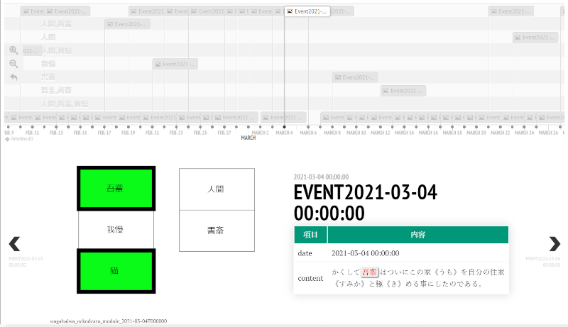
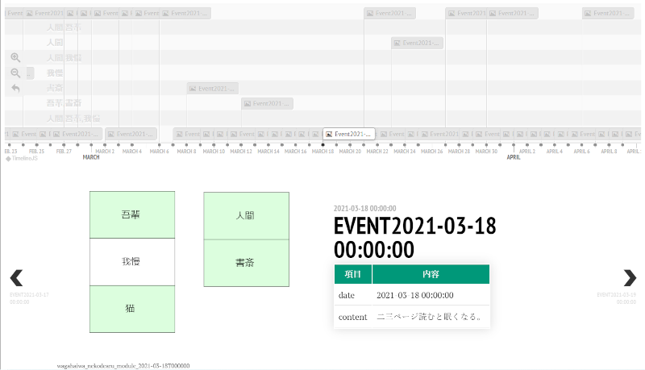
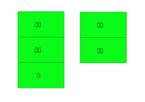

<!-- File: TextTimeseries2.md                      -->
<!-- Description:               -->
<!-- Copyright (C) 2021 by m.na.akei   -->
<!-- Time-stamp: "2021-05-09 13:34:16" -->

# [実験的機能] テキスト文書の時系列データ分析について考えてみる(2) #

## 何が問題か？

「記録間での関連や出現パターンを見るための語句の出現のタイムライン表示」の可視化を新たに考えてみる。
先の表示では以下の内容を見せていた。

- 語句グループの出現タイミングをタイムライン上に表示
- タイムライン上の時刻に対応したテキスト文書を表示

タイムライン上で選択した時刻のテキスト文書とそれ以前のテキスト文書との関連性は、注目語句に関してはタイムライン上で見る事が出来る。
だが、直感性に欠けるものがあり、人の視点を重視する初期分析には少し物足りない。
また製造系の業務文書を考えた場合、語句の対応する装置の図面との紐付け表示や語句を上位概念にグループ化した表示も欲しい。

## どうするか？

これに対応する表示として、直近の注目語句の出現状況を可視化する為に以下のものを考えてみた。

- 別途用意した図面、例えば機材構成図や語句を図形表示したSVGを取り込み表示する
- 注目語句の出現に合わせて対応する図形要素の背景色の表示を強調表示する
- 同一語句の短時間での出現に合わせて図形要素の枠線の太さを変更する
- 語句の出現からの経過時間で背景色の強調度合い、枠線の太さを低減する
- 一定期間、例えば様子見期間等に対応して、関連性喪失の期間を指定可能とする

出力例は以下の通り。




### 与えるSVG図面
図面としては取り扱いと表示のし易さからSVGを採用した。
処理対象となるSVG図面の条件は以下の通り。

- 語句は`<text><tspan>語句</tspan></text>`の構造で埋め込む
- 対応する図形要素は`rect`とする
- 語句と図形要素はグループ化する

SVGのタグ構造は以下のようなものを想定している。
rectには、適当な背景色が設定されているものとして、時間経過を示すために透明度と枠線の太さを制御して、タイムライン表示で用いる。

```svg
<g>
  <rect/>
  <text><tspan>語句</tspan></text>
</g>
```

作成した図面サンプルは以下の通り。作成は「[Inkscape](https://inkscape.org/)」により行った。
Inkscapeでは、四角を描画し、テキストを配置して、グループ化することにより、上記の要件を満たした図形要素が作成できる。

例: wagahaiwa_nekodearu_module.svg  



### 語句と図面の対応付けマップ

製造系の業務文書を考えた場合、語句の対応する装置の図面との紐付け表示や語句を上位概念にグループ化するために、
オプションとしてこの置換えを行うためのマップファイルを与える機能を用意した。

マップファイルの書式は、テキストファイルとして各行で半角コロン":"で区切っって"図面上の語句:テキスト中の語句リスト"の形式で指定する。

先の例では、("吾輩","我慢"=>"猫")、("人間","書斎"=>"人間")に結びつけて図面上の図形要素として表示するために以下のマップファイル(wagahaiwa_nekodearu_map.txt)を用いた。

```text
猫: 吾輩,我慢
人間: 人間,書斎
```

### 関連性喪失の期間の指定

業務文書では、短期間の関連性が重要なことがある。
例えば、製造系での改修後に「様子を見る」や「しばらく注意する」といった場合である。
または、文書の作成者の記憶から影響を受けやすい期間という観点でも同じことが言えると思う。

この点に対応する期間設定として期間日数を指定し、その期間中に同じ語句が現れなかった場合に、定常状態、つまり無色(透明度=1)にする。


### 対応するコマンド

上記の機能を
[csv\_tools: command line tools to handle CSV\(Comma Separated Value\) file by python and bash script](https://github.com/maundergit/csv_tools)
の`csv_utility/csv_print_html_tl.py`として実装した。

コマンドオプションとして`--module_figure`に`図面[:期間日数]`を指定することで先に示したタイムライン表示を行うHTMLを作成する。
同時に語句を別名でマッピングする`--words_map`を用いることで、図面上の対応付マップを指定する。

コマンドを実行するとHTMLファイルの生成と同時に、カレントディレクトリに`fig`ディレクトリを作成し、各イベントに対する図面を作成する。
なお期間日数のデフォルトは14日としている。

以下は、図面=`wagahaiwa_nekodearu_module.svg`、期間日数=`7`、マップファイル=`wagahaiwa_nekodearu_map.txt`として指定する例である。

```shell
csv_print_html_tl.py --datetime_format='%Y-%m-%d' --columns=date --part_color='吾輩,人間,我慢,書斎'\
 --group_by_part_color --output wagahaiwa_nekodearu_2.html --module_figure "wagahaiwa_nekodearu_module.svg:7"\
 --words_map=wagahaiwa_nekodearu_map.txt  wagahaiwa_nekodearu.csv date content
```


<!-- ------------------ -->
<!-- Local Variables:   -->
<!-- mode: markdown     -->
<!-- coding: utf-8-unix -->
<!-- End:               -->
