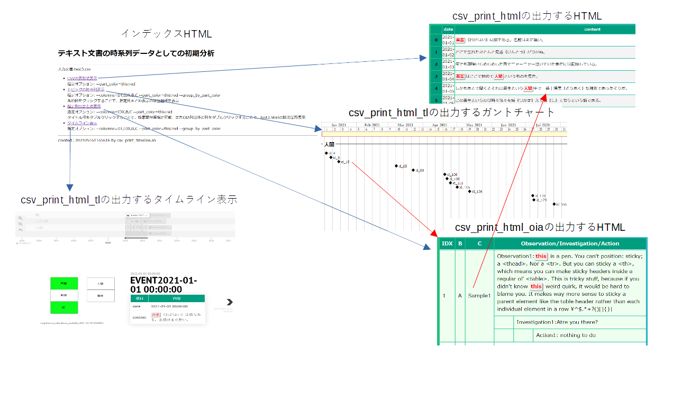
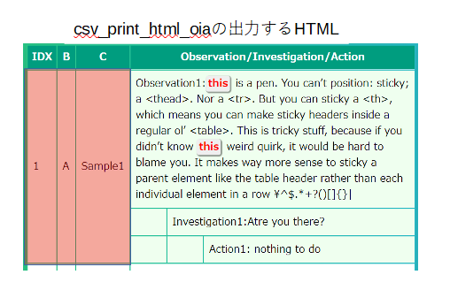

<!-- File: TextTimeseries3.md                      -->
<!-- Description:               -->
<!-- Copyright (C) 2021 by m.na.akei   -->
<!-- Time-stamp: "2021-05-16 16:23:44" -->

# [実験的機能] テキスト文書の時系列データ分析について考えてみる(3) #

## 何を改良するか？

ここまでの
[テキスト文書の時系列データ分析について考えてみる](Texttimeseries.md "テキスト文書の時系列データ分析について考えてみる")
、
[テキスト文書の時系列データ分析について考えてみる(2)](Texttimeseries2.md "テキスト文書の時系列データ分析について考えてみる(2)")
では、CSV形式の時刻付き文書断片を複数のツールでHTML化することを考えた。

これだけでも、業務文書に現れる語句の追跡や時刻分布／季節変動を俯瞰するには、役に立つが、語句の使われ方を追いかけて見るには少し不便なところがある。
例えば以下のガントチャート形式で語句出現の時刻分布で各ポイントでの語句の使われ方や前後の文書との関連を見たいときに、都度別ファイルを開いて、
ID等を探すことは、ストレスになる。


サンプルのSVGは 
[ここ](https://htmlpreview.github.io/?https://github.com/maundergit/csv_tools/blob/master/examples/wagahaiwa_nekodearu.svg)
にある。

そこで、以下のツールで生成するHTML/SVG間で連携して利用する機能を付加する。

## 改良点

以下の機能を追加してみた。

- `csv_print_html_tl.py`で生成される語句出現の時刻分布のガントチャートから、`csv_print_html_oia.py`で生成される指定列のまとめ表示へのリンクの追加
- `csv_print_html_oia.py`で生成される指定列のまとめ表示から、外部リソースへリンクを作成するための汎用機構の追加

2つ目の汎用機構は、ユーザ作成のJavascriptを呼び出すことで、外部DBの呼び出しや、HTMLファイル内のハッシュタグによるジャンプなどを行う機能である。

付随する機能として以下のものも実装した。

- HTMLファイルの後ろに"?"に続いて語句を指定することで、ブラウザの検索機能により、対象語句の位置まで移動する
- リンク利用可能な要素を示すために、マウスカーソルが重なると強調(ボールド)／フォントサイズを大きくするようにした
- `csv_print_html.py`と`csv_print_html_oia.py`の生成するHTMLで、注目語句指定と同時に、注目語句を含まないレコードの非表示機能を追加
- 複数の出力を一括するためのインデクスファイルの生成

上記の処理を行うために`csv_utility/csv_print_html.py`、`csv_utility/csv_print_html_oia.py`、`csv_utility/csv_print_html_tl.py`に補助情報の出力機能を追加し、
処理をまとめて実行するシェルスクリプト `csv_utility/csv_print_timeline.sh`を作成した。

```shell
テキスト文書の時系列データとしての初期分析用ツール
Usage: csv_print_timeline.sh [optins]  csv_file datetime_column observation_column [investigation_column [action_column]]
options:
  -a columns: "指定列のまとめ表示"における追加表示列、ここで指定した列は先頭列に表示される
  -c part_color: 強調表示する指定語句,正規表現が指定可能
  -d datetime_format: 時刻列の書式
  -m module_figure_option: タイムライン表示に表示される図面情報
  -p words_map_file: タイムライン表示に表示される図面情報と指定語句の対応関係を指定するテキストファイル
  -t options:  csv_print_html.pyに対する追加オプション

  '-a'については'csv_print_html_oia.py --help'の'--columns'の項を参照のこと
  '-c'については'csv_print_html.py --help'又は'csv_print_html_oia.py --help'の'--part_color'の項を参照のこと
  '-d','-m','-p'については'csv_print_html_tl.py --help'の'--datetime_format'、'--module_figure'、'--words_map'の項を参照のこと
  '-t'については'csv_print_html_tl.py --help'のオプションを参照

remark:
  このツールは、以下のツール群を一括適用するためのシェルスクリプトです。
  各ツールで生成されるHTML、SVG間のハイパーリンクを設定し、相互に行き来することを可能とします。
  csv_print_html.py,csv_print_html_oia.py,csv_print_html_tl.py

  'oia_handler.js'を修正することで"指定列のまとめ表示"からのリンクジャンプ先を制御可能です。

example
  csv_print_timeline.sh -c "吾輩,人間,我慢,書斎" wagahaiwa_nekodearu.csv date contente content
  csv_print_timeline.sh -c "吾輩,人間,我慢,書斎" -m "wagahaiwa_nekodearu_module.svg:7" -p wagahaiwa_nekodearu_map.txt wagahaiwa_nekodearu.csv date content
  csv_print_timeline.sh -a IDX,B,C -c 'this:red' csv_print_html_sample.csv  DT O I A
  csv_print_timeline.sh -a IDX,B,C -c 'this:red' -t '--headline=IDX' csv_print_html_sample.csv DT O I A

```

このシェルスクリプトで生成される、複数のHTML/SVGをまとめたインデクスHTMLファイルを起点にした画面遷移図は以下の通り。



赤線部分は、ダブルクリックによりジャンプが行われる。なおダブルクリック可能な部分にカーソルを当てると強調表示される。

生成されたインデクスファイルHTMLのサンプルは
[ここ](https://htmlpreview.github.io/?https://github.com/maundergit/csv_tools/blob/master/examples/csv_print_html_sample_index.html)
にある。

### `csv_print_html_oia.py`で生成される指定列のまとめ表示から、外部リソースへリンクを作成するための汎用機構

`csv_print_timeline.sh`の`-a`(`csv_print_html_oia.py`の`--columns`)で指定された列は、下図の赤色のエリアに表示され、
ダブルクリックによりHTMLと同じディレクトリにある`oia_handler.js`内で定義される`oia_dblclick_from_td()`が起動される。




`oia_dblclick_from_td()`は、赤色エリアの情報と、ダブルクリックされた入力CSVファイル中での行番号(nrec)を持つ、以下のような引数を持って呼び出される。
行番号は0で開始される数字である。

```json
{nrec: 0, IDX: "1", B: "A", C: "Sample1"}
```
この`oia_handler.js`は、`csv_print_timeline.sh`実行時にテンプレートが生成されるので、それを編集して使えば良い。
なお、`csv_print_timeline.sh`実行時に既に`oia_handler.js`が存在する場合でも、上書きを行うことに注意。


<!-- ------------------ -->
<!-- Local Variables:   -->
<!-- mode: markdown     -->
<!-- coding: utf-8-unix -->
<!-- End:               -->
